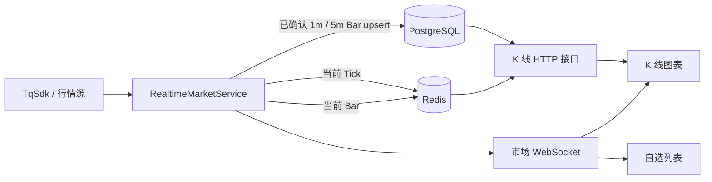
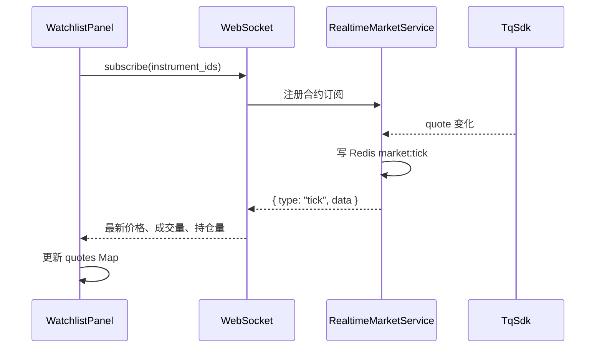
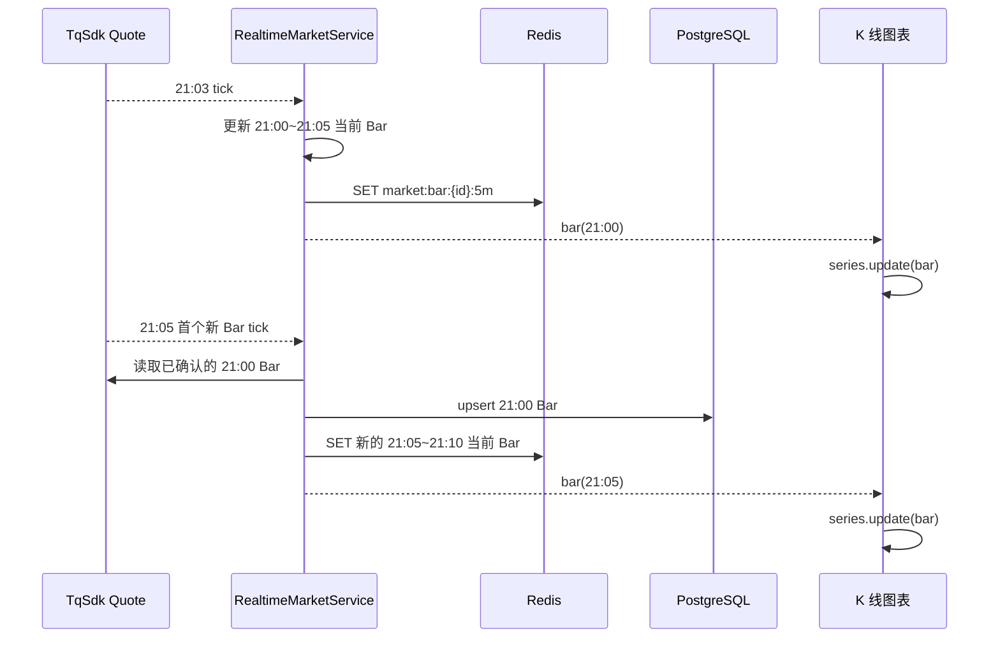

# 实时行情与 K 线同步

本文说明 Pulse 中自选列表实时价格、K 线历史加载和 K 线实时更新的完整数据流。

## 目标

- 自选列表持续显示订阅合约的最新价格。
- 图表首次加载时获得连续的历史 K 线和当前未完成 Bar。
- 图表运行期间只更新最后一根或新增一根 K 线。
- 已完成 K 线最终写入 PostgreSQL，服务重启、前端重连后可从接口恢复。
- Redis 只保存短生命周期的实时状态，不承担长期历史存储。

## 总体架构



## 数据职责

| 存储/通道 | 保存内容 | 用途 |
| --- | --- | --- |
| PostgreSQL | 已确认的 `1m`、`5m` K 线 | 历史查询和长期持久化；`15m`、`30m`、`1h` 由 `5m` 聚合。 |
| Redis | 当前 Tick、每个合约/周期的一根当前 Bar | 低延迟实时展示；不保存历史 Bar。 |
| WebSocket | Tick 和当前 Bar 事件 | 推送给已打开的自选列表和图表。 |
| `/klines/bars` | PostgreSQL 历史 + Redis 当前 Bar | 图表切换、刷新和重连时的完整快照。 |

Redis 键约定：

```text
market:tick:{instrumentId}
market:bar:{instrumentId}:{interval}
```

其中 `market:bar` 只保留当前一根 Bar；旧的 `market:bars:*` Hash 历史结构不再使用。

## 自选列表实时价格

`WatchlistPanel` 使用 `useRealtimeQuotes` 打开市场 WebSocket，并订阅自选列表所有合约。



自选列表只消费 `tick` 事件，不依赖 K 线接口或 PostgreSQL，因此价格展示可以保持高频更新。

## K 线首次加载

切换合约或周期时，前端 `useKlineData` 请求：

```text
GET /klines/bars?instrument_id=...&interval=...&from=...&to=...&count_back=800
```

接口处理规则：

1. 从 PostgreSQL 读取对应周期的已确认历史数据。
2. `15m`、`30m`、`1h` 由已确认的 `5m` 数据聚合。
3. 从 Redis 读取当前周期的 `market:bar`。
4. 若当前 Bar 位于查询时间范围内，按时间戳合并；同一时间戳时 Redis 当前 Bar 覆盖数据库数据。
5. 返回按时间升序排列的完整序列。

前端 `useChartBars.render()` 对接口结果调用一次 `series.setData()`。因此前端不再维护“历史 Map + Redis 历史 Map”的双重拼接逻辑。

## 当前 Bar 更新与确认落库

以 `5m` 周期为例：



具体规则：

- `RealtimeMarketService` 根据 Tick 时间计算当前周期的 bucket。
- bucket 改变时，上一根内存/Redis Bar 被视为完成候选。
- 服务端通过 TqSdk K 线序列读取该时间点的已确认 Bar；能读取到时以行情源数据为准，读取失败才回退到内存聚合值。
- 已确认的 `1m`、`5m` Bar 使用主键 `(instrument_id, date_time)` 写入 PostgreSQL，并执行 `upsert`。
- `15m`、`30m`、`1h` 不单独建表；其历史结果由已落库 `5m` 聚合，当前未完成 Bar 从 Redis 取得。

## 图表实时更新规则

图表 `useRealtimeKline` 仅处理当前选中合约和当前周期的 `bar` 事件。

```text
接口加载：series.setData(完整快照)
WebSocket 当前 Bar：series.update(bar)
WebSocket 新 Bar：series.update(bar)
过期 Bar：忽略，等待下一次接口快照恢复
```

这意味着 WebSocket 不负责补历史缺口。前端刷新、重新选择合约/周期或重新建立图表时，始终以 `/klines/bars` 的合并快照为准。

## 服务启动与订阅回填

Redis 被清空或服务重启后不需要人工恢复 Redis 数据。

当某个合约首次被 WebSocket 订阅时：

1. 服务向 TqSdk 请求该合约各周期的最近 K 线。
2. 最近已完成的 `1m`、`5m` Bar 会批量 `upsert` 到 PostgreSQL，用于补齐服务停机或订阅前的近端缺口。
3. 每个周期最后一根 Bar 被保存为 Redis 当前 Bar。
4. WebSocket 向新订阅者发送这些当前 Bar。

若 PostgreSQL 从未同步过该合约，近端回填数量不足以满足图表历史需求时，仍应通过管理端执行完整 K 线同步。

## 常见问题

### 为什么不能让前端保存大量实时历史 Bar？

前端会在刷新、关闭页面、断线后丢失内存数据，也无法可靠判断某根 Bar 是否完成。历史归档和最终数据确认应由服务端完成。

### 为什么已完成 Bar 还要用 TqSdk 校验？

实时 Bar 是按 Tick/Quote 聚合的，可能受网络抖动、服务重连或漏 Tick 影响。Bar 完成时使用行情源给出的确认 K 线覆盖候选值，能提升 PostgreSQL 历史数据准确性。

### 为什么指标会影响切换合约速度？

切换合约后主 K 线 `setData()` 会触发已加载 Pine 指标对整批历史数据重新计算。该性能问题与 K 线实时数据拼接无关；实时链路现在只更新当前 Bar，避免因前端拼接历史数据触发额外的全量 K 线重绘。

